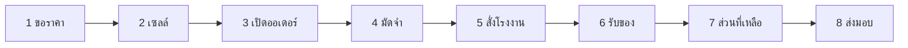

# เช็กลิสต์ลงมือทำ — SOP ทั้งวงจร

ใช้กับออเดอร์ **หนึ่งใบ** จากต้นจนจบ คู่กับไดอะแกรมใน [SOP-CYCLE.md](./SOP-CYCLE.md)

เครื่องหมาย: ☐ ยังไม่ทำ · ✓ ทำแล้ว · ✗ ข้าม / ไม่ผ่าน · — ไม่เกี่ยวกับใบนี้

---

## ใบงานนี้

| ช่อง | ค่าที่กรอกตอนทำ |
|---|---|
| วันที่เริ่ม | |
| ผู้ทำเซลล์ | |
| ผู้ทำบัญชี | |
| ผู้ดูแลโรงงาน | |
| รหัสคำขอ | |
| รหัสออเดอร์ | |
| รหัสใบสั่งโรงงาน | |
| รหัสใบรับสินค้า | |
| ลิงก์ชำระมัดจำ | |

**หยุดทันทีถ้า**

- ลูกค้ายังไม่ได้อนุมัติแบบและราคา → อย่าเปิดออเดอร์
- มัดจำยังไม่ถูกบัญชีอนุมัติ → อย่าสั่งโรงงาน
- ของยังไม่เข้าคลังหรือส่งตรง → อย่าเรียกเก็บส่วนที่เหลือ
- ชำระยังไม่ครบ → อย่าจัดส่งถึงลูกค้า และอย่าออกใบกำกับภาษี

---

## ขั้นที่ 1 — ลูกค้าขอใบเสนอราคา

ผู้ทำ: ลูกค้า หรือเซลล์ช่วยกรอก  
หน้า: `/products` แล้ว `/contact`

- [ ] เปิดสินค้าที่ต้องการ ตรวจว่ามีข้อความสกรีนโลโก้ได้ และราคาเป็นช่วงโดยประมาณ
- [ ] กด **ขอใบเสนอราคา** ไปหน้าติดต่อ
- [ ] กรอกผู้ติดต่อ → งานที่ต้องการ (จำนวน วิธีสกรีน วันที่ต้องการ) → ที่อยู่
- [ ] ติ๊กยินยอม แล้วกด **ส่งคำขอใบเสนอราคา**
- [ ] หน้าสำเร็จขึ้น **ส่งคำขอสำเร็จ** พร้อมรหัสคำขอ — ยังไม่มีการชำระเงิน
- [ ] คัดลอกรหัสคำขอใส่ตารางด้านบน

ตรวจใน Ops: `/ops/quotes` สถานะ **ใหม่** และมีลูกค้าผูกอีเมลแล้ว

ถ้าส่งไม่สำเร็จ: อย่าให้ลูกค้าโอนเงินนอกระบบเพื่อ “จองคิว”

---

## ขั้นที่ 2 — เซลล์ติดต่อและส่งใบเสนอราคา

ผู้ทำ: เซลล์  
หน้า: `/ops/quotes` → `/ops/quotes/[รหัสคำขอ]`

- [ ] เปิดคำขอสถานะ **ใหม่**
- [ ] โทรหรือไลน์ตามเบอร์/ชื่อในคำขอ ยืนยันจำนวน สี วิธีสกรีน จุดส่ง วันที่ใช้งาน
- [ ] เปลี่ยนสถานะเป็น **ติดต่อแล้ว** กรอกบันทึกฝ่ายขาย แล้วกด **บันทึก**
- [ ] ส่งใบเสนอราคาให้ลูกค้าทางไลน์/อีเมล (ราคานอกเว็บ — ระบบยังไม่ออก PDF)
- [ ] ลูกค้าอนุมัติแบบและราคาแล้ว → เปลี่ยนสถานะเป็น **ส่งใบเสนอราคาแล้ว** แล้วกด **บันทึก**
- [ ] ตรวจว่าฟอร์ม **เปิดใบสั่งซื้อ / วางบิลมัดจำ** ปรากฏด้านล่าง

ถ้าลูกค้าไม่ซื้อ: เปลี่ยนเป็น **ไม่สำเร็จ** แล้วหยุดใบนี้ที่นี่

ถ้าบัตรภาษียังไม่ครบ: ไป `/ops/customers/[id]` กรอกชื่อในใบกำกับ เลข 13 หลัก ที่อยู่ ผู้ซื้อ ก่อนเปิดออเดอร์

---

## ขั้นที่ 3 — เปิดออเดอร์และวางบิลมัดจำ

ผู้ทำ: เซลล์  
หน้า: รายละเอียดคำขอเดิม

- [ ] กรอก **ยอดตามใบเสนอราคา (บาท)** ให้ตรงใบที่ลูกค้าอนุมัติ
- [ ] ตรวจ VAT 7% (ค่าเริ่มต้นไม่รวม VAT)
- [ ] มัดจำโหมดอัตโนมัติ: รวมไม่เกิน 10,000 บาท = เก็บเต็ม จำนวนมากกว่านั้น = 50%
- [ ] ตรวจชื่อออกบิลมาจากบัตรภาษีลูกค้า ไม่ใช่จังหวัดจัดส่ง
- [ ] กด **เปิดออเดอร์และสร้าง QR พร้อมเพย์**
- [ ] คัดลอกรหัสออเดอร์ใส่ตารางด้านบน
- [ ] ส่งลิงก์หน้าออเดอร์หรือ QR ให้ลูกค้า (`/orders/[orderId]` หรือ `/pay/[voucherId]`)
- [ ] เปลี่ยนสถานะคำขอเป็น **ปิดการขาย** เมื่อลูกค้าเริ่มวงจรมัดจำ

ตรวจ: `/ops/orders/[orderId]` สถานะเงิน **รอชำระมัดจำ** สถานะสินค้า **จองสินค้าแล้ว** มีใบแจ้งหนี้มัดจำ

---

## ขั้นที่ 4 — ลูกค้าโอนมัดจำ บัญชีอนุมัติ

ผู้ทำ: ลูกค้า แล้วบัญชี  
หน้าลูกค้า: `/orders/[orderId]` หรือ `/pay/[voucherId]`  
หน้าบัญชี: `/ops/approvals`

### 4ก ลูกค้า

- [ ] สแกน QR พร้อมเพย์ตามยอดมัดจำ
- [ ] กด **แจ้งโอนเงินและแนบสลิป**
- [ ] เห็นข้อความว่ารอบัญชีตรวจสอบ — **ยังไม่ถือว่าชำระสำเร็จ**

### 4ข บัญชี

- [ ] เปิด `/ops/approvals` เลือกรายการ **ดูสลิป / อนุมัติ**
- [ ] เทียบรูปสลิปกับยอดและชื่อบัญชีพร้อมเพย์
- [ ] ยอดตรงและเงินเข้าแล้ว → กด **อนุมัติรับเงินมัดจำ … บาท**
- [ ] ยอดไม่ตรง / สลิปไม่ชัด / ผิดบัญชี → กรอกเหตุผลอย่างน้อย 4 ตัวอักษร แล้วกด **ปฏิเสธยอดนี้** แล้วรอลูกค้าโอนใหม่ (กลับไป 4ก)

ตรวจ: ออเดอร์เป็น **ชำระมัดจำแล้ว** มีใบเสร็จรับเงินมัดจำ  
ถ้าเก็บเต็มจำนวนในงวดเดียว: สถานะเงินเป็น **ชำระครบแล้ว** — ข้ามขั้นที่ 7 ได้เมื่อของถึงคลัง

**อย่าสั่งโรงงานถ้าขั้นนี้ยังไม่ผ่าน**

---

## ขั้นที่ 5 — สั่งโรงงานจีน

ผู้ทำ: ผู้ดูแล (เซลล์ไม่มีสิทธิ์เห็นต้นทุน)  
หน้า: `/ops/orders/[orderId]` → **สร้างใบสั่งโรงงาน** หรือ `/ops/factory-po/new?orderId=…`

- [ ] ตรวจว่ามัดจำถูกอนุมัติแล้ว
- [ ] กรอกชื่อโรงงาน แพลตฟอร์ม (1688 / Alibaba / โรงงานตรง) สเปคโลโก้ ตำแหน่ง สี จำนวน
- [ ] กรอกต้นทุนโรงงาน ขนส่งในจีน เฟรท ภาษีนำเข้า แพ็ก จัดส่งลูกค้า
- [ ] เลือกปลายทาง **เข้าคลังไทย** หรือ **ไม่เข้าคลัง — ส่งตรงลูกค้า**
- [ ] กด **สร้างใบสั่งโรงงาน** แล้วคัดลอกรหัสใบสั่ง
- [ ] เปลี่ยนสถานะใบสั่งเป็น **ส่งโรงงานแล้ว** แล้วกด **บันทึกใบสั่งโรงงาน**
- [ ] โรงงานตอบรับแล้ว → สถานะ **โรงงานยืนยันแล้ว** (ระบบลงบัญชีต้นทุน)
- [ ] เริ่มผลิต → **กำลังผลิต** แล้วที่ออเดอร์กด **อัปเดตสถานะ** เป็น **กำลังผลิต**
- [ ] ของออกจากจีน → ใบสั่ง **ออกจากจีนแล้ว** ออเดอร์ **กำลังขนส่งจากจีน**
- [ ] รอศุลกากร → ทั้งคู่เป็น **รอเข้าประเทศ**

ถ้ายังมัดจำไม่ครบ ระบบจะไม่ให้เลื่อนออเดอร์ไปรอสั่งผลิต

---

## ขั้นที่ 6 — รับสินค้าเข้าไทย

ผู้ทำ: ผู้ดูแล / คลัง  
หน้า: `/ops/inbound` หรือจากใบสั่งกด **รับสินค้าตาม PO**

- [ ] เลือกใบสั่งโรงงาน ใส่จำนวนที่รับจริง
- [ ] ถ้ามีของเสีย ใส่จำนวนของเสียในใบรับ — ระบบเปิดเคลมโรงงานให้
- [ ] เลือกปลายทางให้ตรงใบสั่ง (เข้าคลังไทย หรือส่งตรงลูกค้า)
- [ ] ใส่บันทึก QC แล้วกด **บันทึกการรับ**
- [ ] คัดลอกรหัสใบรับ เปิดพรีวิว / PDF ถ้าต้องการ
- [ ] เข้าคลัง: ตรวจ `/ops/assets` มีล็อตสินค้า และออเดอร์เป็น **เข้าคลังสินค้าแล้ว**
- [ ] ส่งตรง: ออเดอร์ข้ามคลังไป **กำลังจัดส่งถึงลูกค้า** ได้เมื่อชำระครบแล้วเท่านั้น

ถ้าบิลยังมัดจำอยู่: ระบบออก **ใบแจ้งหนี้ส่วนที่เหลือ** อัตโนมัติเมื่อของถึงคลังหรือส่งตรง

ของเสีย: ไป `/ops/claims` ติดตามเคลมโรงงาน อย่าจ่ายโรงงานเต็มจำนวนของที่เสียโดยไม่เคลม

---

## ขั้นที่ 7 — ชำระส่วนที่เหลือ

ผู้ทำ: ลูกค้า แล้วบัญชี  
ข้ามขั้นนี้ถ้าขั้นที่ 4 เก็บเต็มจำนวนแล้ว

- [ ] ส่งใบแจ้งหนี้ส่วนที่เหลือ / QR ให้ลูกค้า
- [ ] ลูกค้าโอนและกด **แจ้งโอนเงินและแนบสลิป**
- [ ] บัญชีเปิด `/ops/approvals` เทียบสลิป แล้วกด **อนุมัติรับเงินส่วนที่เหลือ … บาท**
- [ ] ตรวจออเดอร์เป็น **ชำระครบแล้ว**

ถ้าปฏิเสธ: กรอกเหตุผล กด **ปฏิเสธยอดนี้** แล้วรอโอนใหม่ — **อย่าจัดส่ง**

---

## ขั้นที่ 8 — ใบกำกับภาษีและส่งถึงลูกค้า

ผู้ทำ: เซลล์ / คลัง  
หน้า: `/ops/orders/[orderId]`

- [ ] ตรวจว่าสถานะเงินเป็น **ชำระครบแล้ว**
- [ ] ตรวจว่าของอยู่ที่ **เข้าคลังสินค้าแล้ว** หรือ **กำลังจัดส่งถึงลูกค้า** หรือ **ส่งถึงลูกค้าแล้ว**
- [ ] ตรวจว่ามี **ใบกำกับภาษี** และ **ใบเสร็จรับเงิน** (ระบบออกเมื่อสองข้อบนครบ)
- [ ] เลื่อนสถานะสินค้าเป็น **กำลังจัดส่งถึงลูกค้า** แล้วกด **อัปเดตสถานะ**
- [ ] ส่งของถึงจุดส่งในไทย แล้วเปลี่ยนเป็น **ส่งถึงลูกค้าแล้ว**
- [ ] ส่งลิงก์หน้าออเดอร์ให้ลูกค้าดูเอกสาร

ถ้ายังไม่มีใบกำกับ: ตรวจบัตรภาษีลูกค้า (เลข 13 หลัก + ที่อยู่ผู้ซื้อ) และว่ายอด/สถานะสินค้าครบเงื่อนไขหรือยัง

---

## ขั้นที่ 9 — จ่ายโรงงาน (หลังรับของ)

ผู้ทำ: ผู้ดูแล  
หน้า: `/ops/pay-factory`

- [ ] เปิดใบสั่ง ดูยอดที่รับได้ vs ยอดที่จ่ายแล้ว
- [ ] จ่ายได้ไม่เกินยอดสินค้าที่รับ
- [ ] กด **บันทึกจ่ายโรงงาน**
- [ ] ตรวจ `/ops/finance` ว่าออเดอร์นี้มีต้นทุนแล้ว กำไรขั้นต้นไม่ว่าง

---

## ขั้นที่ 10 — หลังขายถ้ามีปัญหา

ผู้ทำ: ลูกค้าหรือเซลล์  
หน้าลูกค้า: `/issues` · หน้า Ops: `/ops/issues` `/ops/claims`

- [ ] เปิดเรื่องคุณภาพ / สกรีน / ของไม่ครบ / จัดส่ง — หน้านี้ไม่มีการชำระเงิน
- [ ] ผูกออเดอร์หรือใบรับถ้ามี
- [ ] ของเสียตอนรับ: ใช้เคลมที่ระบบเปิดให้อัตโนมัติ
- [ ] ปิดเรื่องเมื่อแก้ไขแล้ว

---

## สรุปผลใบนี้

| ข้อ | ค่า |
|---|---|
| จบวงจรหรือยัง | ใช่ / ไม่ขาย / ค้างที่ขั้นที่ __ |
| ใบกำกับเลขที่ | |
| วันส่งถึงลูกค้า | |
| หมายเหตุ | |
