# SOP ทั้งวงจร — สั่งผลิตสกรีนโลโก้จากจีน จัดส่งไทย

สินค้าที่ลูกค้าขอใบเสนอราคาก่อน แล้วค่อยสั่งผลิตจากจีน สกรีนโลโก้ใส่ได้ **ไม่ใช่ของพร้อมส่ง** และยังไม่ชำระเงินบนเว็บจนกว่าเซลล์เปิดออเดอร์

เอกสารนี้เป็นคู่มือปฏิบัติการภายใน คู่กับ [OPS-CONSOLE.md](./OPS-CONSOLE.md)

คู่มือภาพหน้าจอแบบ SPA (ต้องมีโทเค็น): [/sop](http://localhost:3000/sop)

ลงมือทำทีละขั้น: [SOP-CHECKLIST.md](./SOP-CHECKLIST.md)

---

## 1. มุมลูกค้า (3 ขั้น)

ราคาบนเว็บเป็นช่วงโดยประมาณ ไม่ใช่ใบเสนอราคา

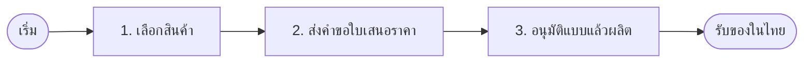

**อ่านยังไง:** ลูกค้าไม่ต้องรู้โรงงาน 1688 ต้นทุน หรือบัญชี — เห็นแค่เลือก ส่งคำขอ แล้วรออนุมัติแบบก่อนผลิต

| ขั้น | หน้า | หมายเหตุ |
|---|---|---|
| เลือกสินค้า | `/` `/products` `/giftset/[category]` | ช่วงราคาโดยประมาณ + สกรีนโลโก้ได้ |
| ส่งคำขอ | `/contact` LINE | ยังไม่ชำระเงิน ยังไม่ใช่ยืนยันสั่งซื้อ |
| อนุมัติแบบแล้วผลิต | เซลล์ติดต่อนอกเว็บ แล้วเปิดออเดอร์ | ตัวอย่างในเว็บไม่ใช่แบบผลิต |

---

## 2. วงจรหลักทั้งเส้น

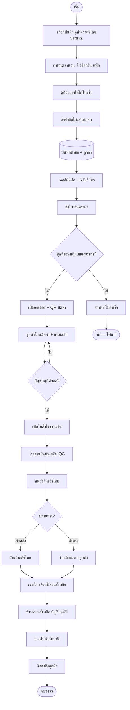

**อ่านยังไง:** ไหลจากบนลงล่างตามงานจริง แยกเส้นเมื่อลูกค้าไม่ซื้อ และเมื่อของเข้าคลังไทยหรือส่งตรงลูกค้า

**ประตูล็อกในระบบ**

- ยังไม่มีมัดจำ → สั่งผลิตไม่ได้
- ยังชำระไม่ครบ → ส่งถึงลูกค้าไม่ได้
- ใบกำกับภาษีออกเมื่อชำระครบ **และ** ของอยู่ที่คลัง / กำลังจัดส่ง / ส่งแล้ว

---

## 3. ใครทำอะไร

| บทบาท | ทำ | ไม่ทำ |
|---|---|---|
| ลูกค้า | เลือกสินค้า ส่งคำขอ อนุมัติแบบ โอนเงิน แนบสลิป ติดตามออเดอร์ แจ้งปัญหา | ไม่เห็นต้นทุนโรงงาน / 1688 |
| เซลล์ | ติดต่อ ร่างราคา เปิดออเดอร์ รับสลิปเข้าระบบ | ไม่เห็นต้นทุนโรงงาน กำไรขั้นต้น ไม่เปิดใบสั่งโรงงาน |
| ผู้ดูแล | ใบสั่งโรงงาน จ่ายโรงงาน งบผู้บริหาร จัดการผู้ใช้ | — |
| บัญชี | อนุมัติหรือปฏิเสธสลิปที่ `/ops/approvals` | ไม่ยืนยันเงินจาก OCR อัตโนมัติ |
| คลัง | รับของตาม PO ลงสต็อก/ล็อต · จองออเดอร์ · ตัดตอนส่ง · ปรับ/โอน/ตรวจนับ · เปิดเคลมของเสีย | จ่ายโรงงานเกินยอดที่รับไม่ได้ · ไม่ตัดสต็อกติดลบ |

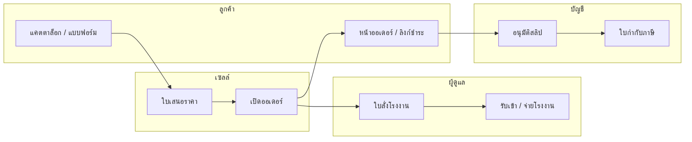

---

## 4. ลำดับข้อความ — ขอใบเสนอราคา

บันทึกคำขอก่อนทุกอย่าง ถ้า webhook ล้มเหลวต้องไม่ทำคำขอหาย

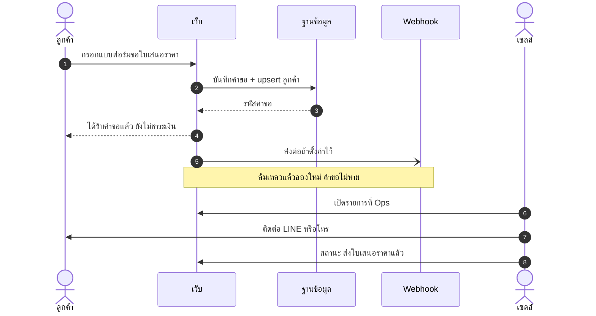

**อ่านยังไง:** ลูกค้าได้รหัสคำขอทันที เซลล์ทำงานจาก Ops หลังบันทึกสำเร็จ

หน้า: `/contact` → `/ops/quotes` → `/ops/quotes/[requestId]`

สถานะคำขอ: ใหม่ → ติดต่อแล้ว → ส่งใบเสนอราคาแล้ว → ปิดการขาย / ไม่สำเร็จ / เก็บถาวร

---

## 5. ลำดับข้อความ — มัดจำถึงใบกำกับภาษี

กติกา: VAT 7% · มัดจำเต็มจำนวนถ้าบิลรวม VAT ไม่เกิน 10,000 บาท ไม่เช่นนั้น 50% · QR พร้อมเพย์ · ที่อยู่ออกบิลมาจากบัตรภาษีลูกค้า ไม่ใช่จังหวัดจัดส่ง

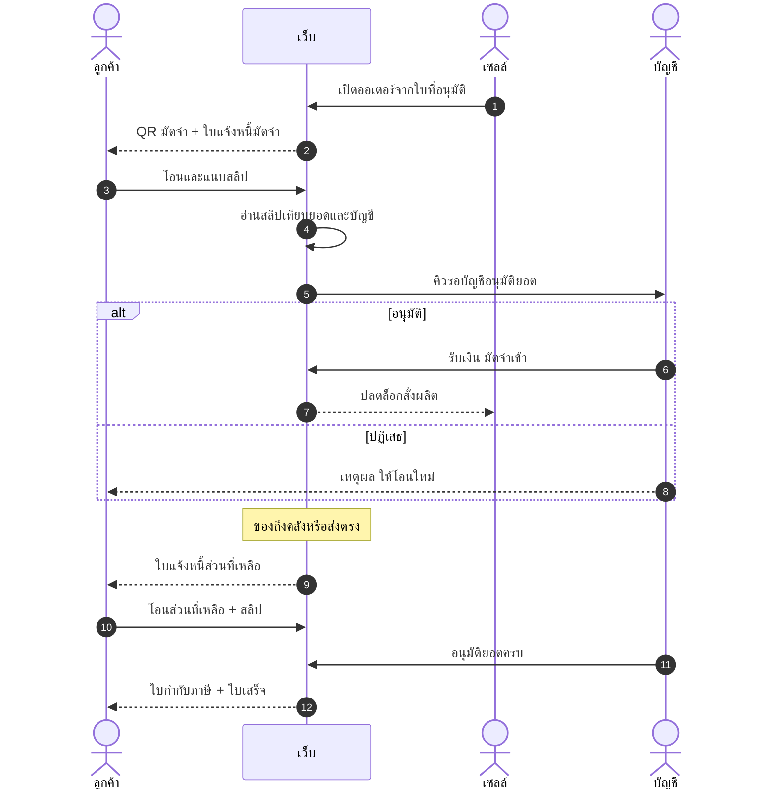

**อ่านยังไง:** OCR ช่วยเทียบสลิป แต่บัญชีกดรับเงินเอง ใบกำกับไม่ออกจนกว่าชำระครบและของถึงขั้นคลังหรือจัดส่ง

หน้า: `/ops/orders` `/pay/[voucherId]` `/ops/approvals` `/ops/receipts`

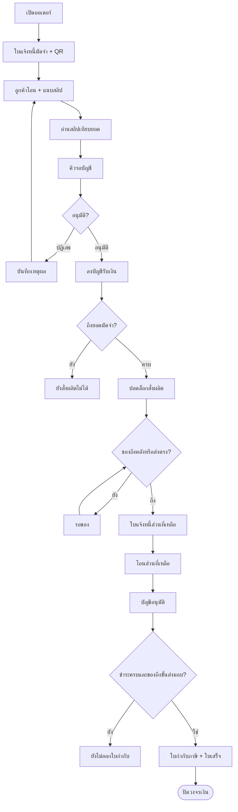

เอกสารที่ออกตามจังหวะ

| เอกสาร | เมื่อไหร่ |
|---|---|
| ใบแจ้งหนี้มัดจำ | เปิดออเดอร์ |
| ใบเสร็จรับเงินมัดจำ | บัญชีอนุมัติมัดจำ |
| ใบแจ้งหนี้ส่วนที่เหลือ | ของเข้าคลัง หรือส่งตรงลูกค้า |
| ใบกำกับภาษี + ใบเสร็จ | ชำระครบ และของถึงคลัง / กำลังส่ง / ส่งแล้ว |

สถานะสลิปแต่ละงวด: รอชำระ → รอบัญชีอนุมัติยอด → รับชำระแล้ว / บัญชีปฏิเสธ / หมดอายุ

---

## 6. ลำดับข้อความ — โรงงาน รับของ จ่ายโรงงาน

ใบสั่งโรงงานเป็นงานผู้ดูแล เซลล์ไม่เห็นต้นทุนโรงงาน

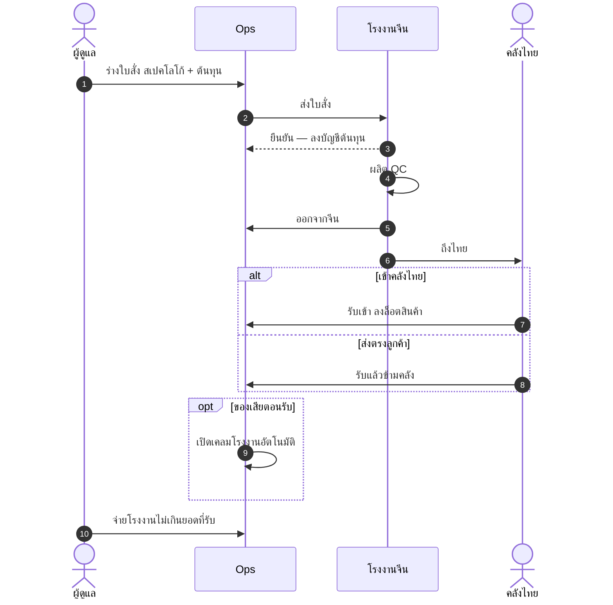

**อ่านยังไง:** จ่ายโรงงานตามของที่รับจริง ไม่จ่ายตามยอดสั่งล่วงหน้าทั้งก้อนถ้ายังรับไม่ครบ

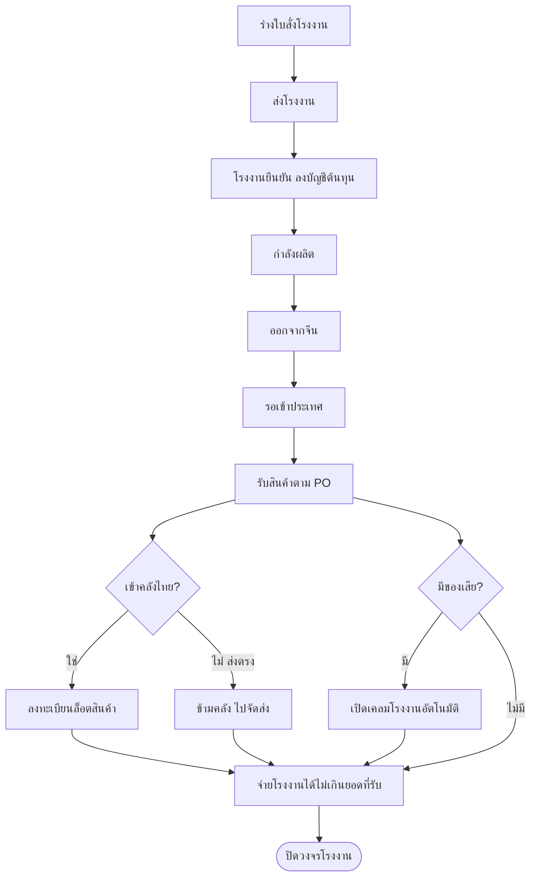

หน้า: `/ops/factory-po` `/ops/inbound` `/ops/pay-factory` `/ops/assets` `/ops/claims`

---

## 7. สถานะในระบบ

### คำขอใบเสนอราคา

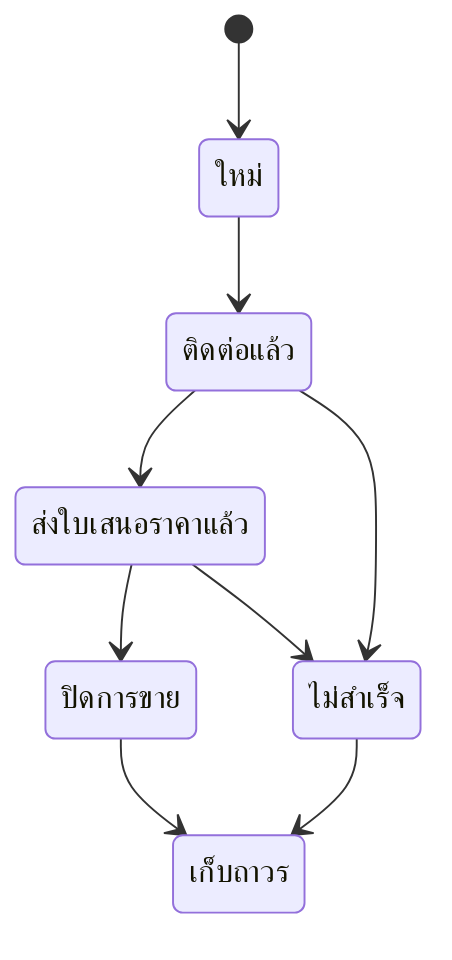

เปิดออเดอร์ได้จากคำขอที่สถานะส่งใบเสนอราคาแล้ว หรือปิดการขาย

### การชำระเงินของออเดอร์

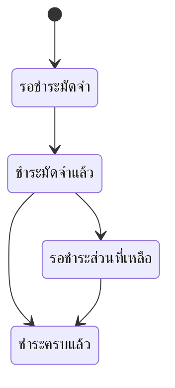

ถ้าบิลรวม VAT ไม่เกิน 10,000 บาท มัดจำ = เต็มจำนวน จะข้ามไปชำระครบหลังอนุมัติงวดเดียว

### สินค้าในออเดอร์

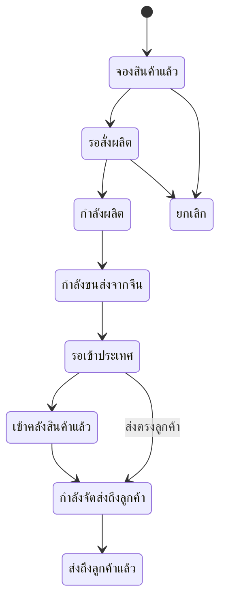

### ใบสั่งโรงงาน

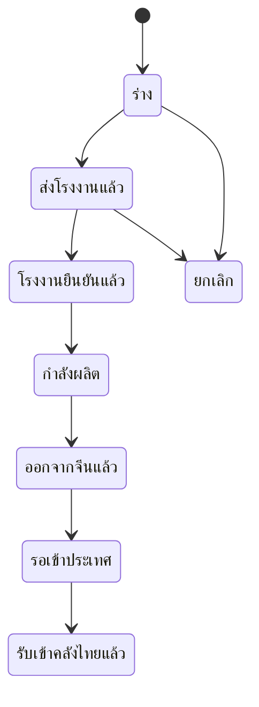

---

## 8. จุดรับเรื่องหลังขาย

| เรื่อง | หน้า | ผล |
|---|---|---|
| คุณภาพ สกรีน ของไม่ครบ จัดส่ง | `/issues` และ `/ops/issues` | เปิดตั๋ว ไม่มีการชำระเงินในหน้านี้ |
| ของเสียตอนรับตาม PO | `/ops/inbound` | เปิดเคลมโรงงานอัตโนมัติ |
| เคลมโรงงาน ลูกค้า ขนส่ง | `/ops/claims` | ติดตามสถานะเคลม |

---

## 9. หน้า Ops ที่ใช้ตามขั้น

| ขั้น SOP | URL |
|---|---|
| คำขอใบเสนอราคา | `/ops/quotes` |
| ลูกค้า / บัตรภาษี | `/ops/customers` |
| ออเดอร์ รับชำระ | `/ops/orders` |
| อนุมัติสลิป | `/ops/approvals` |
| ใบรับเงิน / QR | `/ops/cycle` `/ops/receipts` `/ops/qr-pay` |
| ใบสั่งโรงงาน | `/ops/factory-po` |
| รับสินค้าเข้า | `/ops/inbound` |
| คลัง / คงเหลือ | `/ops/stock` |
| เคลื่อนไหวสต็อก | `/ops/stock/movements` |
| ปรับ / โอนสต็อก | `/ops/stock/adjust` |
| ตรวจนับสต็อก | `/ops/stock/counts` |
| จ่ายโรงงาน | `/ops/pay-factory` |
| งบผู้บริหาร | `/ops/finance` |
| แคตตาล็อกสาธารณะ | Strapi จากเมนู Ops |

### คลังสินค้า (WMS)

แหล่งความจริงรอบแรกอยู่ที่ **SQLite** (`wms_balances` / `wms_movements` / `wms_reservations`) หลังรับเข้าคลัง:

1. กรอก **product key** (หรือใช้ `sourceOfferId` จาก PO) + ที่เก็บ (`BIN-DEFAULT` / `BIN-QC`)
2. ระบบเพิ่ม `qty_on_hand` และจองสต็อกให้ออเดอร์อัตโนมัติเมื่อของพอ
3. ของเสียเข้า location QC แยกจากชั้นวางขาย
4. เมื่อสถานะออเดอร์เป็น `out_for_delivery` / `delivered` → ตัด on-hand และ consume reservation
5. ยกเลิกใบรับ (void) ได้ถ้ายังไม่จ่ายโรงงานเกินยอดรับใหม่ — กลับสต็อก + ledger

MySQL: apply `db/mysql/wms_core.sql` (`node scripts/apply-wms-mysql.mjs`) แล้ว `node scripts/sync-wms-mysql.mjs` และตั้ง `WMS_STORE=mysql` — รายละเอียดใน [WMS.md](./WMS.md)

---

## 10. สิ่งที่ห้ามบนหน้าลูกค้า

- ราคาโรงงานหยวน ขั้นบันไดราคา ต้นทุนขนส่งในจีน
- ส่วนต่างกำไร ชั้นสมาชิก รหัสข้อเสนอ 1688
- ข้อความว่ามีสินค้าพร้อมส่ง
- ชำระเงินก่อนมีใบเสนอราคาที่เซลล์อนุมัติ
