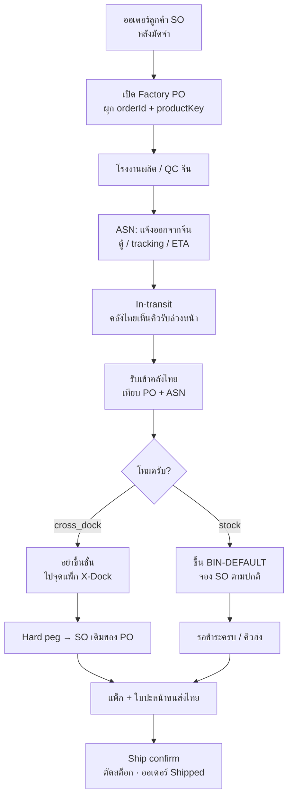

# Cross-Dock / In-Transit — ปรับจาก Oracle ให้เข้ากับธุรกิจ Terabis / SmartGift

เอกสารนี้แปลงแนวคิด Oracle (ASCP · ASN · WMS Mobile · Cross-Dock · Ship Confirm)  
ให้เข้ากับธุรกิจจริง: **ของขวัญองค์กรสั่งผลิตจากจีน สกรีนโลโก้ จัดส่งไทย** — ไม่ใช่คลังขายปลีกขนาดใหญ่

คู่กับ: [SOP-CYCLE.md](./SOP-CYCLE.md) · [WMS.md](./WMS.md) · [WMS-CROSS-DOCK-FLOW.md](./WMS-CROSS-DOCK-FLOW.md)

---

## 1. ความต่างของธุรกิจ (ทำไมห้ามลอก Oracle ตรง ๆ)

| Oracle (ทั่วไป) | Terabis / SmartGift |
|-----------------|---------------------|
| สต็อกพร้อมขายจำนวนมาก หลาย SO แย่งของเดียวกัน | ส่วนส่วนใหญ่ **ผลิตตามออเดอร์** (make-to-order) 1 SO ↔ 1–N PO |
| ASCP วางแผน supply อัตโนมัติ | เซลล์เปิด SO หลังมัดจำ → admin เปิด Factory PO มือ (กฎธุรกิจ) |
| RF Scanner + Oracle WMS Mobile | Ops บนเว็บ + มือถือเบราว์เซอร์ก่อน (สแกนเนอร์เป็นเฟสถัดไป) |
| Cross-dock ลด putaway ใน DC ใหญ่ | คลังไทยเล็ก — **ข้ามชั้นวาง** = รับแล้วแพ็กส่งลูกค้าเลย |
| Ship Confirm ตัดศูนย์เพราะ DC หมุนเร็ว | ตัดตอน `out_for_delivery` / `delivered` — อาจเหลือสต็อก Class C / ของเสีย QC |

**กฎธุรกิจที่ต้องคงไว้**

- ยังไม่มีมัดจำ → สั่งโรงงานไม่ได้  
- ยังชำระไม่ครบ → ส่งถึงลูกค้าไม่ได้  
- ใบกำกับออกเมื่อชำระครบ **และ** ของถึงขั้นคลัง/กำลังส่ง/ส่งแล้ว  
- Zero-PII ใน vault สินค้า · ราคาโรงงานไม่โชว์ลูกค้า  

---

## 2. แมปคำศัพท์ Oracle → ของเรา

| Oracle | ของเรา (ชื่อในระบบ) | สถานะปัจจุบัน |
|--------|---------------------|----------------|
| Sales Order (SO) | `orders` + fulfillment | มี |
| Purchase Order (PO) | `factory_po` ใบสั่งโรงงานจีน | มี · ผูก `orderId` แล้ว |
| Back-to-back / Pegging | Soft peg: `wms_reservations` + `sourceOfferId` / `productKey` | มีจองตอนรับ · ยังไม่ hard peg ตอนสร้าง PO |
| ASN | **ใบแจ้งของออกจากจีน** (สถานะ PO `shipped`/`inbound` + tracking) | มีฟิลด์ `asn_eta` / `asn_qty` / `asn_container` บน Factory PO |
| In-Transit Inventory | รายงานของระหว่างทาง (PO ที่ shipped/inbound ยังไม่ครบรับ) | คิว **In-transit** บน `/ops/stock` |
| Receipt | `goods_receipts` + `receiveToStock` | มี |
| Putaway | โอนเข้า `BIN-DEFAULT` / shelf | มีโอน · confirm เมื่อย้ายออกจาก XDOCK |
| Cross-Dock Lane | ที่เก็บ `BIN-XDOCK` + `receive_mode=cross_dock` | **มีแล้ว** — ค่าเริ่มต้น MTO |
| Hard Pegging | จอง/ตัดเฉพาะ SO ที่ผูก PO | จองตอนรับตาม `po.orderId` |
| Packing Slip / Label | `/ops/orders/{id}/pack` | มีใบปะหน้าแพ็ก |
| Ship Confirm | ปุ่มบนออเดอร์ → `out_for_delivery` + ตัดจอง | มี |

---

## 3. โฟลว์ที่ปรับแล้ว (เป้าหมายธุรกิจ)

### โหมดปลายทางที่มีอยู่แล้ว → ขยายความหมาย

| `destinationMode` | ความหมายธุรกิจ | พฤติกรรมคลัง |
|-------------------|----------------|--------------|
| `warehouse` + **เก็บ** | ของเข้าคลังไว้ (สำรอง / หลายรอบส่ง / Class B) | รับ → `BIN-DEFAULT` → จอง → ส่งทีหลัง |
| `warehouse` + **cross_dock** | ของเข้าไทยเพื่อส่งลูกค้าออเดอร์นั้นทันที | รับ → `BIN-XDOCK` → ห้าม putaway → แพ็ก → ส่ง |
| `ship_to` | ไม่เข้าคลัง (ส่งตรง/ข้ามคลัง) | รับแล้วข้ามคลัง · ไม่ขึ้น balance (ของเดิม) |

**ค่าเริ่มต้นธุรกิจของขวัญสั่งผลิต:** หลัง ASN ส่วนใหญ่ควรเป็น **cross_dock**  
เก็บขึ้นชั้นเฉพาะเมื่อ: ของเหลือ, เคลียร์ Class C, สต็อกโปรโมชัน, หรือลูกค้ายังไม่ชำระครบและต้องพักของ

---

## 4. รายละเอียดทีละขั้น (ปรับจาก 1–4 ที่ให้มา)

### 4.1 สั่งซื้อจากจีน + ระหว่างทาง (Procurement & In-Transit)

**Oracle:** ASCP ลิงก์ SO↔PO อัตโนมัติ + ASN  

**ของเรา:**

1. **Back-to-back แบบง่าย (ไม่ใช้ ASCP)**  
   - เมื่อเปิด Factory PO บังคับ `orderId` (มีอยู่แล้ว)  
   - บังคับ `productKey` / `sourceOfferId` ตั้งแต่ร่าง PO (ไม่รอตอนรับ)  
   - หนึ่ง PO = หนึ่ง SO เป็นค่าเริ่ม (อนุญาตหลาย PO ต่อ SO เมื่อแยกโรงงาน/รอบส่ง)

2. **ASN = สถานะ + ฟอร์ม “แจ้งของออกจากจีน”**  
   - เมื่อ PO → `shipped` / `inbound` กรอก: เลขตู้หรือ tracking ระหว่างประเทศ, ETA ไทย, จำนวนที่คาด, รูป/ใบโหลด (ถ้ามี)  
   - บันทึกเป็นเหตุการณ์ออเดอร์ + แสดงในคิว **In-transit** ที่ `/ops/stock` และ `/ops/inbound`  
   - คลังไทยเห็นล่วงหน้าว่าจะรับ SKU อะไร กี่ชิ้น ของ SO ไหน

3. **รายงาน In-Transit**  
   - = PO ที่ `shipped|inbound` และ `receivedQty < quantity`  
   - คอลัมน์: PO, SO, SKU, ค้างรับ, tracking, ETA, โหมด (เก็บ / cross-dock / ส่งตรง)

### 4.2 รับเข้าคลังไทย (Inbound Receiving)

**Oracle:** สแกน RF เทียบ PO+ASN  

**ของเรา (เฟส A — ใช้ได้ทันที):**

- รับที่ `/ops/inbound` เลือก PO → ระบบดึง ASN/จำนวนที่คาด/productKey  
- ยืนยันจำนวนดี / เสีย / ขาด → เทียบกับ PO (มี `over_received` แล้ว)  
- ถ้ามี ASN จำนวนคาด: แจ้งเตือนเมื่อรับ ≠ ASN (ไม่บล็อกถ้า QC ยอมรับต่าง)

**ของเรา (เฟส B — สแกนภายหลัง):**

- กล้องมือถือ / USB scanner กรอกรหัสกล่องหรือ SKU บนหน้า inbound  
- ยังไม่จำเป็นต้องมีแอป Oracle WMS

### 4.3 Cross-Dock (จับคู่และจ่ายออก — จุดเด่นที่ต้องมี)

**Oracle:** เตือน “Cross-Dock to SO #…” ห้าม putaway + hard peg  

**ของเรา:**

1. เพิ่ม location **`BIN-XDOCK`** (staging / cross-dock lane)  
2. เมื่อรับ PO ที่โหมด cross-dock (หรือ `destinationMode=warehouse` + ธง cross_dock):  
   - รับเข้า `BIN-XDOCK` ไม่ใช่ `BIN-DEFAULT`  
   - UI แสดงแบนเนอร์ชัด: **อย่าขึ้นชั้น — แพ็กส่งออเดอร์ {orderId}**  
   - Hard peg: `reserveForOrder` ด้วย `orderId` จาก PO ทันที (มีโครงอยู่แล้ว)  
3. ห้ามโอนจาก XDOCK → DEFAULT โดยไม่ยืนยัน (confirm แบบเดียวกับโอน QC)  
4. ถ้าลูกค้ายังชำระไม่ครบ: ของพักที่ XDOCK (หรือย้ายไป DEFAULT เป็น “พักรอชำระ”) — ไม่ Ship Confirm

**ไม่ทำ:** FIFO/VIP allocation ซับซ้อนแบบ ASCP — ธุรกิจนี้ของถูก peg กับ SO ตั้งแต่สั่งโรงงานแล้ว

### 4.4 แพ็กและส่งมอบขนส่งไทย (Outbound)

**Oracle:** Auto packing slip + label + Ship Confirm = 0  

**ของเรา:**

1. คิว **พร้อมแพ็ก cross-dock** บน `/ops/stock`: ของใน `BIN-XDOCK` + SO ชำระครบ  
2. พนักงานเปลี่ยน fulfillment → `out_for_delivery` (หรือปุ่ม “ยืนยันส่ง / Ship Confirm”)  
   - เรียก `shipFromStock` ตัดของที่จอง  
   - พิมพ์ใบแพ็ก / ลิงก์ออเดอร์ที่มีอยู่  
3. ใบปะหน้า Kerry/Flash/J&T: เฟสถัดไป (integratio n) — รอบแรกพิมพ์ที่อยู่จัดส่งจากออเดอร์พอ  
4. สต็อกเป็นศูนย์เฉพาะ SKU ที่ peg กับออเดอร์นั้น — ของเสียยังอยู่ `BIN-QC`

---

## 5. สิ่งที่มีแล้ว vs ต้องสร้าง

| ความสามารถ | มีแล้ว | ต้องเพิ่ม |
|------------|--------|-----------|
| SO ↔ Factory PO | ✅ `orderId` บน PO | บังคับ productKey ตั้งแต่สร้าง PO |
| สถานะจีน → ไทย | ✅ shipped / inbound / received | ฟอร์ม ASN + ETA + คิว in-transit |
| รับเข้า + สต็อก + จอง | ✅ | โหมด cross_dock + `BIN-XDOCK` |
| ตัดตอนส่ง | ✅ | ปุ่ม Ship Confirm บนออเดอร์ |
| ห้ามขึ้นชั้น | ✅ | แบนเนอร์ inbound + confirm โอนออก XDOCK |
| สแกนบาร์โค้ด | ✅ เบา | ช่องสแกนบน `/ops/inbound` (wedge/keyboard) |
| Auto shipping label ขนส่งไทย | ❌ | เฟส C / นอก scope — มีใบปะหน้าภายในแล้ว |
| ASCP / VIP allocation | ❌ | **ไม่ทำ** — ไม่เข้าธุรกิจ |

---

## 6. ลำดับลงมือที่แนะนำ

1. **ASN เบา ๆ** — ✅ ฟิลด์ tracking / ETA / qty บน PO + คิว In-transit บน `/ops/stock`
2. **`BIN-XDOCK` + โหมดรับ cross_dock** — ✅ รับแล้วจอง SO + แบนเนอร์ห้ามขึ้นชั้น
3. **คิวพร้อมแพ็ก / Ship Confirm** — ✅ คิวบนคลัง + ปุ่มบนออเดอร์ + ใบปะหน้า `/pack`
4. **บัตรคุม + บัญชี** — ✅ ของ cross-dock ลงบัตรคุมที่ `/ops/stock/{sku}/card`
5. สแกนมือถือฮาร์ดแวร์ / ใบปะหน้าขนส่งภายนอก — ทีหลังเมื่อคลังใช้จริงทุกวัน

---

## 7. สรุปหนึ่งประโยค

Oracle ขาย “วางแผน supply อัตโนมัติใน DC ใหญ่” — เราขาย “**สั่งผลิตตามออเดอร์จากจีน รู้ของระหว่างทาง รับเข้าไทยแล้วข้ามชั้นไปแพ็กส่งลูกค้า (หรือเก็บเมื่อจำเป็น)**” โดยใช้ Factory PO ↔ Order ที่ผูกอยู่แล้ว + WMS/จอง/ตัดที่มีอยู่ ขยายด้วย ASN และ Cross-Dock lane ไม่ต้อง ASCP
