# Workflow Diagrams — Premium Gift Set Web

เอกสารนี้ขยายจาก [../SOP-CYCLE.md](../SOP-CYCLE.md) สำหรับชุดคู่มือ `docs/manual`

---

## W1. มุมลูกค้า (3 ขั้น)

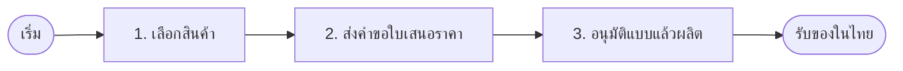

| ขั้น | หน้า | หมายเหตุ |
|------|------|----------|
| เลือกสินค้า | `/` `/products` `/giftset/[category]` | ราคาเป็นช่วงโดยประมาณ |
| ส่งคำขอ | `/contact` LINE | ยังไม่ชำระเงิน |
| อนุมัติแบบ | นอกเว็บ + เปิดออเดอร์ Ops | ตัวอย่างในเว็บ ≠ แบบผลิต |

---

## W2. วงจรหลักทั้งเส้น (RFQ → ส่งมอบ)

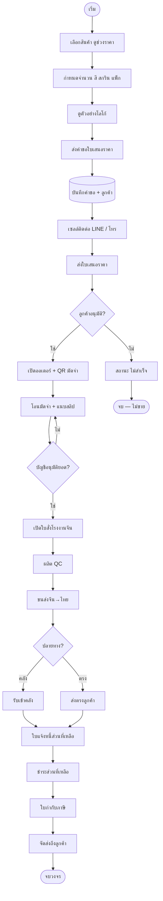

**ประตูล็อก**

- ยังไม่มีมัดจำ → สั่งผลิตไม่ได้
- ยังชำระไม่ครบ → ส่งถึงลูกค้าไม่ได้
- ใบกำกับออกเมื่อชำระครบ **และ** ของอยู่คลัง / กำลังส่ง / ส่งแล้ว

---

## W3. บทบาท × ช่องทาง

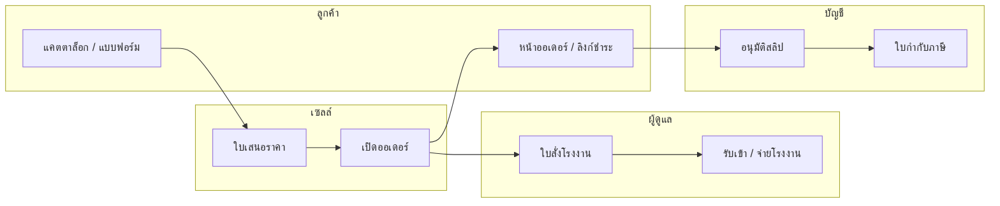

---

## W4. Sequence — ส่งคำขอใบเสนอราคา

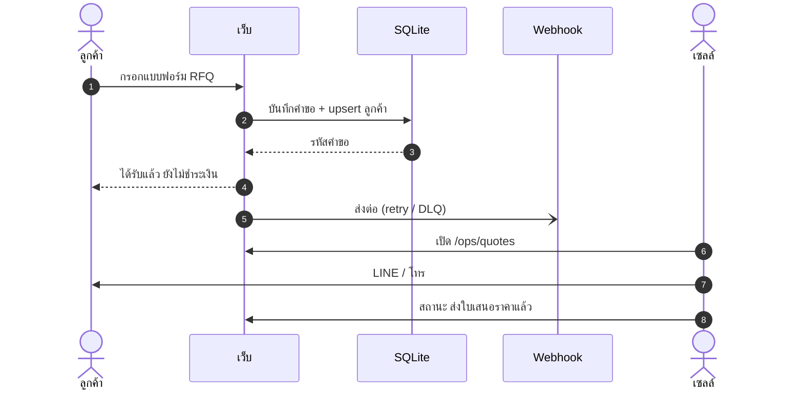

หน้า: `/contact` → `/ops/quotes` → `/ops/quotes/[requestId]`

---

## W5. Sequence — มัดจำถึงใบกำกับ

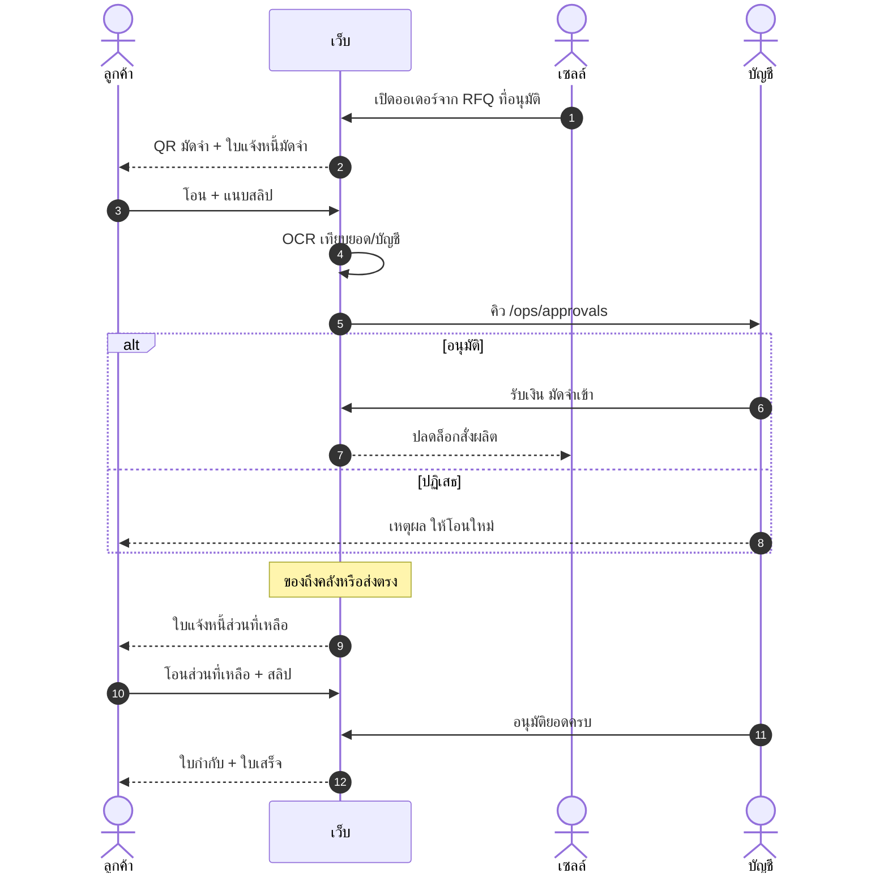

กติกา: VAT 7% · มัดจำเต็มจำนวนถ้ายอดรวม VAT ≤ 10,000 บาท ไม่เช่นนั้น 50%

---

## W6. Flowchart — รับชำระ

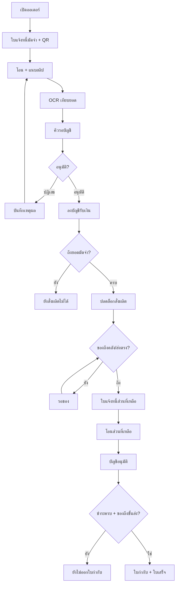

---

## W7. Sequence — โรงงาน / รับของ / จ่าย

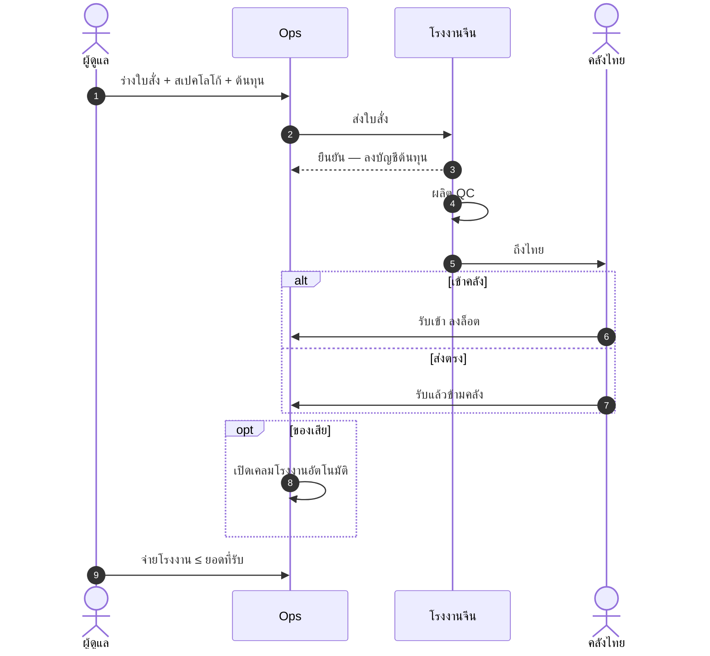

---

## W8. State — คำขอใบเสนอราคา

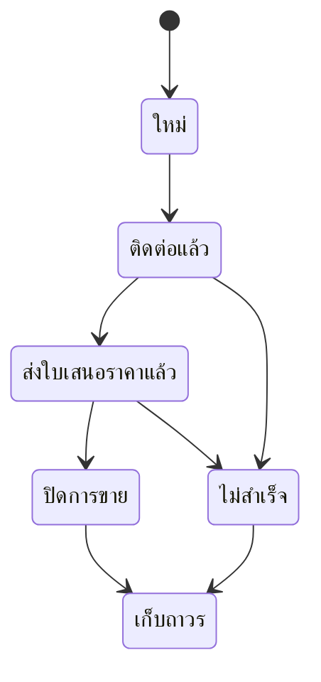

เปิดออเดอร์ได้จากสถานะ `quoted` หรือ `won`

---

## W9. State — การชำระเงินออเดอร์

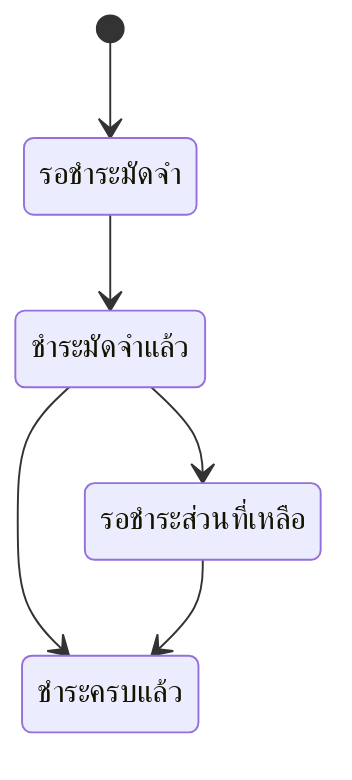

---

## W10. State — สินค้าในออเดอร์ (fulfillment)

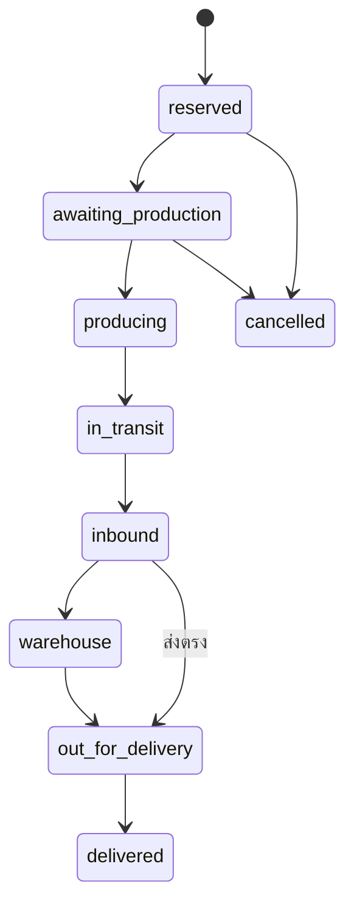

---

## W11. State — ใบสั่งโรงงาน

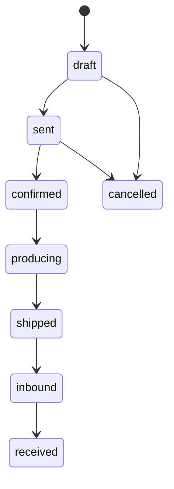

---

## W12. สถาปัตยกรรมระบบ (component)

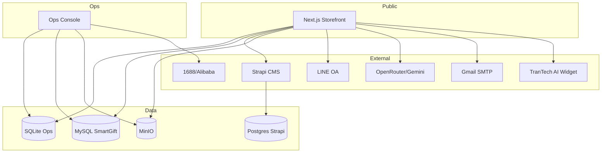

---

## W13. จุดหลังขาย

| เรื่อง | หน้า | ผล |
|-------|------|-----|
| คุณภาพ / สกรีน / ของไม่ครบ / จัดส่ง | `/issues` `/ops/issues` | เปิดตั๋ว (ไม่มีการชำระในหน้านี้) |
| ของเสียตอนรับ PO | `/ops/inbound` | เคลมโรงงานอัตโนมัติ |
| เคลมโรงงาน/ลูกค้า/ขนส่ง | `/ops/claims` | ติดตามเคลม |
