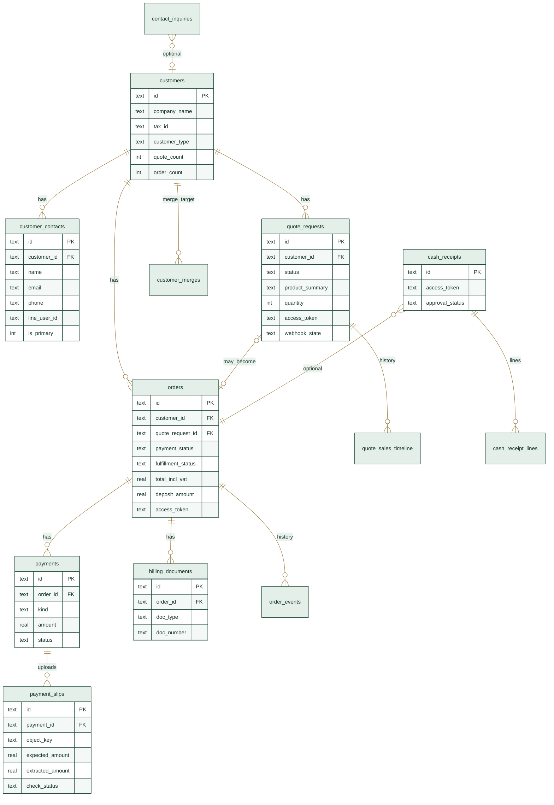
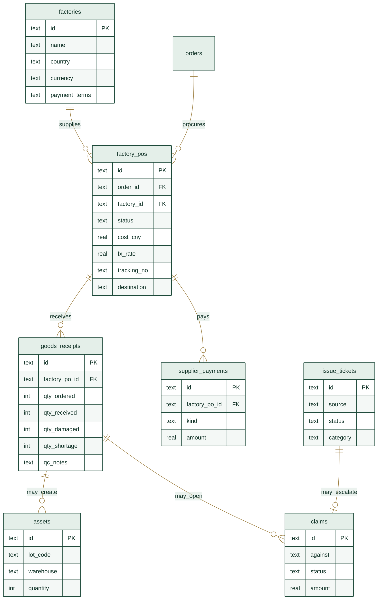
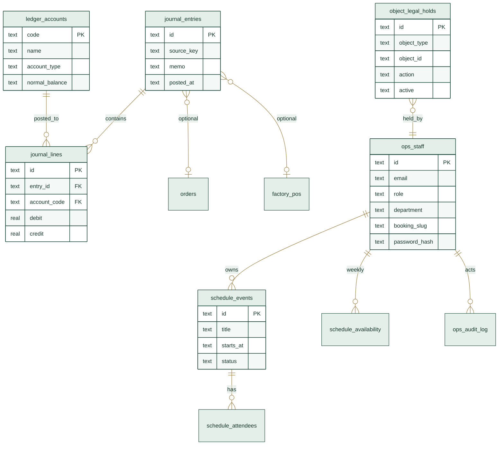
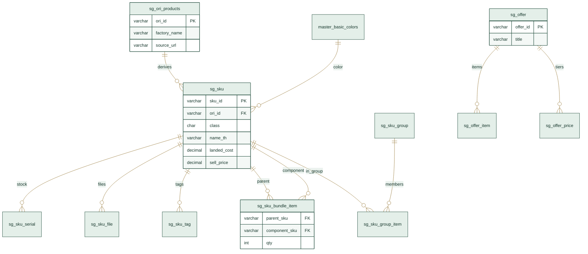
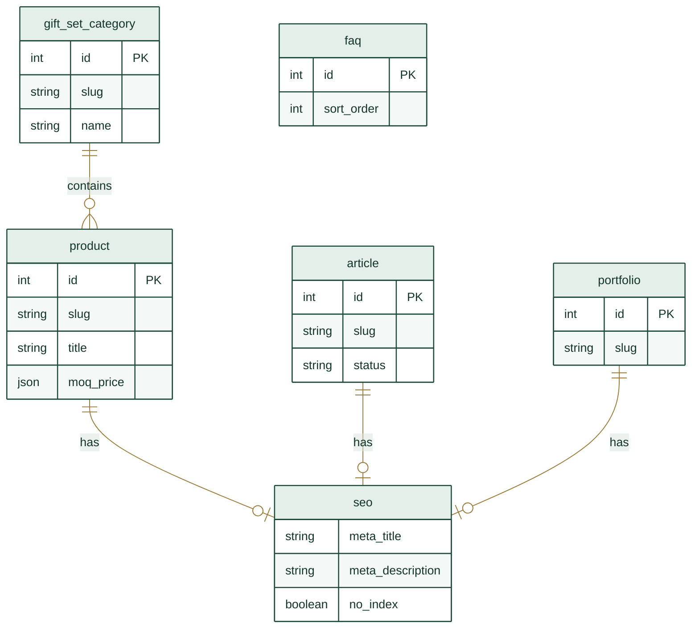

# ER Diagrams — Premium Gift Set Web

แหล่งความจริง: `db/migrations/*.sql`, `db/mysql/sg_sku_master.sql`, `cms/src/api/**`  
ความสัมพันธ์ส่วนใหญ่เป็น logical (application-enforced) — SQLite อาจไม่มี FK ครบทุกตาราง

ใน Ops Work Manual บล็อก `mermaid` จะเรนเดอร์เป็นแผนภาพ SVG อัตโนมัติ (ธีม forest/brass)

---

## ER1. Sales / CRM / Orders / Payments (SQLite)

---

## ER2. Factory / Warehouse / Claims (SQLite)

---

## ER3. Finance / Staff / Schedule / Compliance (SQLite)

---

## ER4. Commercial Catalog (MySQL SmartGift)

**SKU class:** A สต็อก · B สั่งผลิต · C เคลียร์/ของเสีย · D fill-in

---

## ER5. Strapi CMS (PostgreSQL)

---

## แผนที่ฐานข้อมูลรวม

| ฐานข้อมูล | ใช้กับ | ตัวอย่างตาราง |
|-----------|--------|----------------|
| SQLite | Ops / RFQ / Orders / Finance | `customers`, `orders`, `factory_pos` |
| MySQL SmartGift | SKU / Offer / Article overlay | `sg_sku`, `sg_offer` |
| PostgreSQL | Strapi content | Product, Article, Portfolio |
| MinIO | ไฟล์/สลิป/แคตตาล็อก | object keys ในตารางไฟล์ |
